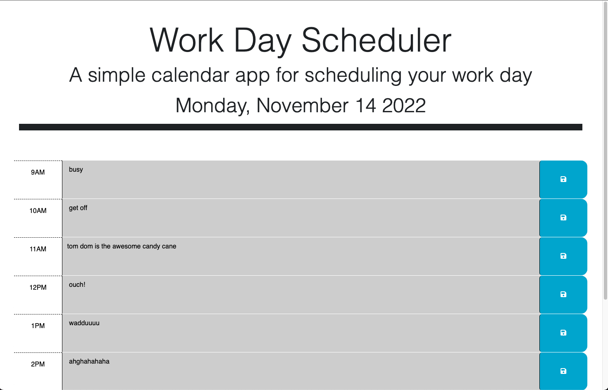
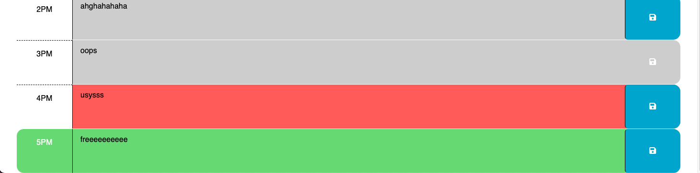

# 05 Third-Party APIs: Work Day Scheduler

During this challenge I needed to use jquery to target the id and class attributes to change the display of the calendar. I also needed to set the localStorage and get the localStorage to save and retrieve the values entered into the calendar. This was the second toughest thing for me to figure out. I had the right concept but didnt execute correctly the first way. Comparing the times and adding or removing the classes was the toughest part in this challenge. Before help I did not think to use setInterval.

## User Story

```md
AS AN employee with a busy schedule
I WANT to add important events to a daily planner
SO THAT I can manage my time effectively
```

## Acceptance Criteria

```md
GIVEN I am using a daily planner to create a schedule
WHEN I open the planner
THEN the current day is displayed at the top of the calendar
WHEN I scroll down
THEN I am presented with timeblocks for standard business hours
WHEN I view the timeblocks for that day
THEN each timeblock is color coded to indicate whether it is in the past, present, or future
WHEN I click into a timeblock
THEN I can enter an event
WHEN I click the save button for that timeblock
THEN the text for that event is saved in local storage
WHEN I refresh the page
THEN the saved events persist
```



